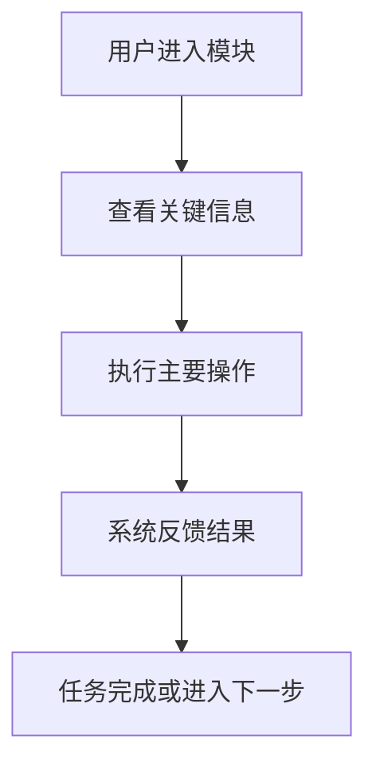

# 交互设计知识文件输出格式

每个生成的功能模块知识文件都使用这个结构。主要读者是交互设计师，目标是帮助设计师快速理解模块目标、用户任务、页面关系、状态变化、交互规则和待确认问题，并据此产出流程图、线框图、原型或设计说明。

````markdown
Feature: [子功能模块名称]

## 0. 模块摘要

- 一句话结论: [这个模块解决什么问题，给用户带来什么结果]
- 目标用户: [主要使用者/操作者/审批者/查看者]
- 核心场景: [用户在什么情况下需要这个功能]
- 核心任务: [用户最重要的 1-3 个任务]
- 设计确定性: [已明确/推断/待确认]
- 关键待确认: [最影响交互方案的问题]

## 1. 背景与目标

- 用户问题: [用户当前遇到的具体问题]
- 业务目标: [业务希望通过该模块达成什么]
- 体验目标: [希望改善效率、理解成本、错误率、信任感等哪类体验]
- 不做什么: [当前模块明确不覆盖的范围，避免设计发散]

## 2. 用户、场景与任务

| 用户/角色 | 使用场景 | 触发条件 | 用户任务 | 成功标准 |
|---|---|---|---|---|
| [角色] | [场景] | [入口/前置条件] | [用户要完成什么] | [用户怎样算完成] |

## 3. 范围与边界

### 本次包含
- [能力/页面/流程]

### 本次不包含
- [暂不设计或不进入本模块的内容]

### 与其他模块的边界
- [入口来源、跳转去向、依赖模块、被影响模块]

## 4. 信息架构

- 核心对象: [实体、记录、资源、任务等]
- 对象关系: [对象之间的包含、引用、归属、流转关系]
- 信息层级: [首屏优先展示什么，什么可以折叠/收起/二级展示]
- 页面/区域结构: [列表、详情、表单、抽屉、弹窗、步骤页等]
- 关键字段: [字段名、含义、来源、是否必填、展示优先级]
- 搜索/筛选/排序: [如适用]

## 5. 用户流程

### 主流程
1. [用户从哪里进入]
2. [用户看到什么关键信息]
3. [用户执行什么操作]
4. [系统如何反馈]
5. [用户如何确认任务完成]

### 分支流程
- [分支]: [触发条件、用户选择、系统反馈、后续去向]

### 异常与恢复
- [异常]: [如何出现、如何提示、用户如何恢复、是否保留已输入内容]

## 6. 页面与交互拆解

| 页面/区域 | 作用 | 关键内容 | 主要操作 | 进入/退出方式 |
|---|---|---|---|---|
| [页面/区域] | [解决什么任务] | [展示什么] | [用户能做什么] | [从哪里来/到哪里去] |

## 7. 交互规则与状态

- 默认状态: [初始表现、默认值、默认排序/筛选]
- 加载状态: [骨架屏/进度/局部 loading/阻塞或非阻塞]
- 空状态: [无数据原因、说明文案、可执行动作]
- 错误状态: [错误原因、提示方式、重试/返回/联系支持]
- 禁用状态: [不可操作原因、是否展示 tooltip 或说明]
- 权限不足: [可见不可操作/不可见/申请权限/联系管理员]
- 成功反馈: [toast、状态更新、页面跳转、局部刷新]
- 危险操作: [二次确认、撤销、影响范围提示]
- 批量操作: [选择规则、跨页选择、部分失败反馈，如适用]

## 8. 权限、规则与约束

- 可见规则: [谁能看到入口、页面、字段或操作]
- 操作权限: [谁能新增、编辑、删除、审批、导出等]
- 业务规则: [校验、限制、阈值、互斥、前后置条件]
- 状态流转: [对象有哪些状态，什么操作触发状态变化]
- 数据约束: [字段来源、必填、默认值、唯一性、同步/异步]
- 风险约束: [误操作、数据丢失、不可逆操作、合规或审计要求]

## 9. 内容与文案要点

- 页面标题/模块命名: [是否已有明确名称]
- 关键按钮文案: [新增/提交/保存/发布/下架等]
- 说明文案: [帮助用户理解规则或后果的文案]
- 错误提示: [需要解释原因和恢复方式]
- 空状态文案: [说明为什么为空，以及下一步可以做什么]

## 10. 视觉辅助

- 图文选择: [流程图/关系图/状态图/时序图/截图/表格/纯文字，并说明原因]
- 关键看点: [设计师看图时应关注的结论]

[如果原 PRD 截图能帮助理解，使用相对路径引用:]


[如果生成图更清楚，使用 Mermaid。示例:]



## 11. 设计产出建议

- 必要产出: [流程图/页面结构图/线框图/高保真/交互说明/状态说明]
- 原型重点: [必须可点击验证的路径或状态]
- 需要覆盖的状态: [默认、空、加载、错误、禁用、权限不足、成功/失败]
- 评审关注点: [信息是否完整、路径是否闭环、异常是否可恢复、风险是否提示]

## 12. 研发协作提示

- 需要研发确认: [接口能力、字段来源、权限判断、异步任务、状态更新方式]
- 可能影响实现复杂度的交互: [实时校验、批量操作、跨页选择、撤销、长任务进度等]
- 埋点/日志建议: [关键点击、提交结果、失败原因、流程转化，如适用]

## 13. 验收标准

- Given [前置条件], When [用户操作], Then [界面反馈/状态变化/数据结果]
- Given [异常条件], When [用户操作], Then [错误提示/恢复路径]
- Given [权限条件], When [用户访问或操作], Then [可见性/可操作性表现]

## 14. 待确认问题

| 问题 | 影响的设计决策 | 建议确认对象 | 优先级 |
|---|---|---|---|
| [问题] | [影响流程/页面/状态/权限/文案等] | [产品/业务/研发/设计] | 高/中/低 |
````

## 写作标准

- 优先服务交互设计，不要把知识文件写成技术实现文档。
- 用来自 PRD 的具体内容替换占位符；没有依据时标记为 `推断` 或 `待确认`。
- 没有具体信息时，不要填泛泛建议，改写为 `暂无明确约束`、`推断` 或 `待确认`。
- 每个模块聚焦一个用户可感知能力，或一组紧密相关的能力。
- 强化用户任务、入口出口、页面关系、状态反馈、异常恢复和权限差异。
- 对危险操作、不可逆操作、批量操作、异步长任务、权限不足、部分失败等高风险交互要明确说明。
- 只有当视觉能提升理解时，才包含 `视觉辅助`。如果文字更清晰，写明 `图文选择: 纯文字更清晰`，并省略图片或 Mermaid。
- 将有用截图保存为 `assets/` 下的文件，并用相对路径引用。不要修改原始 PRD。
- 优先使用 Mermaid 生成流程图、关系图或状态图，让知识文件保持可编辑且适合版本管理。
