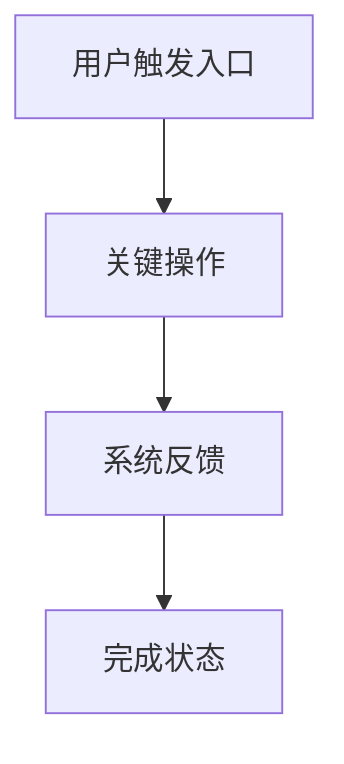

# 知识文件输出格式

每个生成的功能模块知识文件都使用这个结构。

````markdown
Feature: [子功能模块名称]

## 1. 背景与目标

- 解决什么问题: [一句话概括该模块的核心价值]
- 现状与痛点: [当前用户在使用中的具体摩擦点]
- 业务目标: [该模块希望推动的业务结果]
- 体验目标: [该模块希望改善的用户体验]

## 2. 用户与场景

- 目标用户: [主要用户角色]
- 使用场景: [触发该功能的真实上下文]
- 前置条件: [用户、权限、数据、系统状态]
- 频率与重要性: [高频/低频/关键/辅助]

## 3. 用户旅程

- 主干流程:
  1. [用户触发入口]
  2. [关键操作步骤]
  3. [系统反馈]
  4. [完成状态]

- 异常与分支流程:
  - [异常情况 1]: [如何触发、系统如何响应、用户如何恢复]
  - [异常情况 2]: [如何触发、系统如何响应、用户如何恢复]

## 4. 视觉辅助

- 图文选择: [使用截图/流程图/关系图/时序图/状态图/表格/纯文字，并说明原因]
- 关键看点: [读者看图时应关注的结论]

[如果原 PRD 截图能帮助理解，使用相对路径引用:]


[如果生成图更清楚，使用 Mermaid。示例:]



## 5. 功能拆解

- 核心能力:
  - [能力 1]: [用户可执行的动作与系统行为]
  - [能力 2]: [用户可执行的动作与系统行为]

- 操作入口:
  - [入口位置、可见条件、禁用条件]

- 操作结果:
  - [成功后状态变化、数据变化、反馈方式]

## 6. 信息架构

- 关键对象: [实体、字段、关系]
- 信息层级: [哪些信息优先展示，哪些折叠/次级展示]
- 列表/详情/表单结构: [如适用]
- 筛选、搜索、排序: [如适用]
- 状态字段: [可见状态、系统状态、业务状态]

## 7. 交互与状态

- 默认状态: [页面或组件初始表现]
- 加载状态: [加载中反馈]
- 空状态: [无数据时的内容与可操作项]
- 错误状态: [错误提示、重试、恢复路径]
- 禁用状态: [不可用原因与提示]
- 成功反馈: [toast、页面更新、状态变化等]
- 撤销/确认: [是否需要二次确认、是否支持撤销]

## 8. 权限、规则与约束

- 权限规则: [谁可见、谁可操作、谁只能查看]
- 业务规则: [校验、限制、阈值、状态流转]
- 数据规则: [字段来源、必填、默认值、同步/异步]
- 技术约束: [性能、接口、兼容性、平台限制]

## 9. UX/UI 设计要点

- 布局重点: [信息密度、主次关系、响应式注意点]
- 组件建议: [表格、表单、抽屉、弹窗、步骤条等]
- 可用性风险: [误操作、认知负担、反馈不清等]
- 可访问性注意: [对比度、键盘、读屏、焦点顺序等]

## 10. 前端实现上下文

- 可能涉及的页面/组件: [页面、组件、模块]
- 关键状态管理: [本地状态、服务端状态、缓存、乐观更新]
- 接口与数据依赖: [API、字段、事件、埋点]
- 复用机会: [可复用组件或既有模式]

## 11. 待确认问题

- [问题 1]
- [问题 2]
- [问题 3]
````

## 写作标准

- 用来自 PRD 的具体内容替换占位符。
- 只有确认某个章节确实没有价值时，才删除该章节。
- 不确定内容标记为 `待确认`，不要静默补全。
- 推断内容标记为 `推断`。
- 每个模块聚焦一个用户可感知能力，或一组紧密相关的能力。
- 只有当视觉能提升理解时，才包含 `视觉辅助`。如果文字更清晰，写明 `图文选择: 纯文字更清晰`，并省略图片或 Mermaid。
- 将有用截图保存为 `assets/` 下的文件，并用相对路径引用。不要修改原始 PRD。
- 优先使用 Mermaid 生成图示，让知识文件保持可编辑且适合版本管理。
